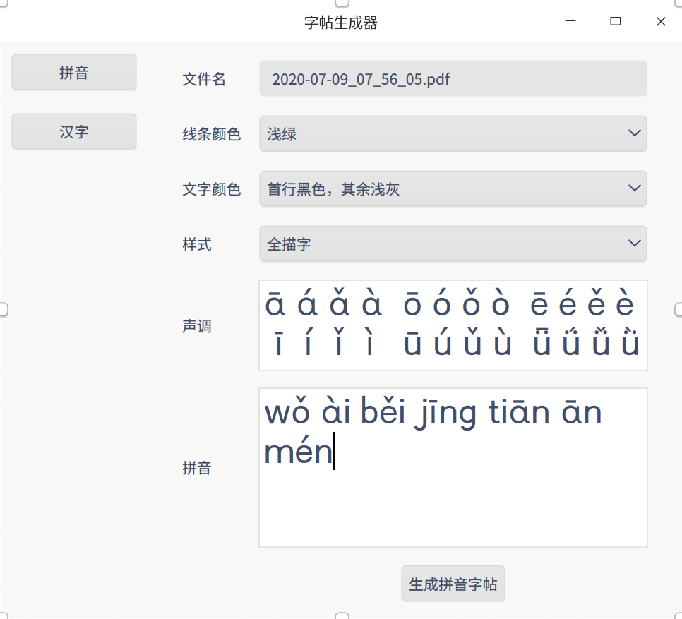
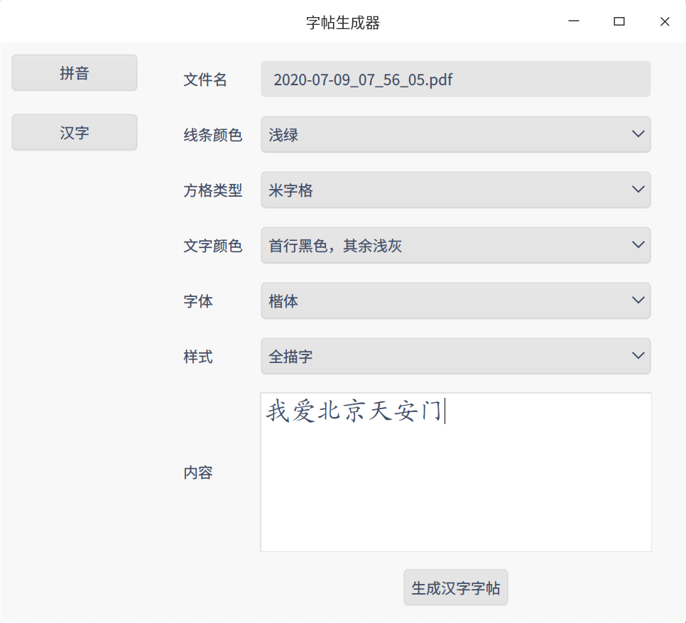

# 安装方法

## 安装依赖包

```bash
pip3 install PyQt5
pip3 install reportlab
pip3 install PyMuPDF
```

## 运行程序

```bas
python3 main.py
```

# 已知问题

1. reportlab处理某些ttf字体时会出错，导致生成PDF文件失败。


# 拼音字帖

按照要求生成拼音字帖。



1. 线条颜色

   可以指定四线格的颜色。

2. 文字颜色

   四线格中拼音的颜色。

3. 样式

   生成PDF的样式

   - 全描字：除首列，整行都会生成拼音。
   - 半描字：除首列，一半生成拼音，一半留空。
   - 不描字：除首列，全部留空。
   - 普通：一个格子一个拼音依次输出。

4. 声调

   方便生成带声调的拼音。

5. 拼音

   生成的PDF中的拼音内容，每个拼音已空格隔开。

   ## 生成的拼音字帖

   

# 汉字字帖



1. 线条颜色

   可以指定方格的颜色。

2. 文字颜色

   可以指定文字的颜色。

3. 字体

   可以指定文字的字体。

3. 样式

   生成PDF的样式

   - 全描字：除首列，整行都会生成文字。
   - 半描字：除首列，一半生成文字，一半留空。
   - 不描字：除首列，全部留空。
   - 普通：一个格子一个汉字依次输出。

   

4. 内容

   生成的PDF中的文字内容。
   
   

